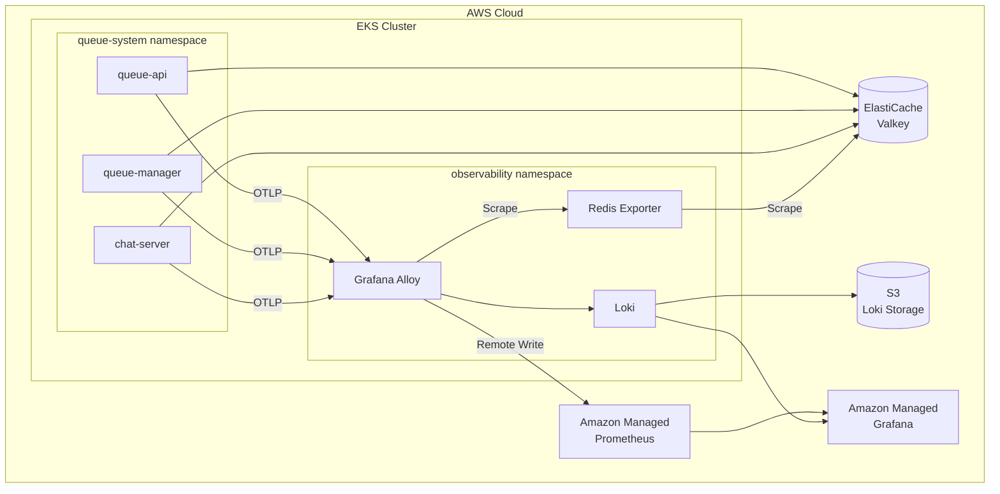
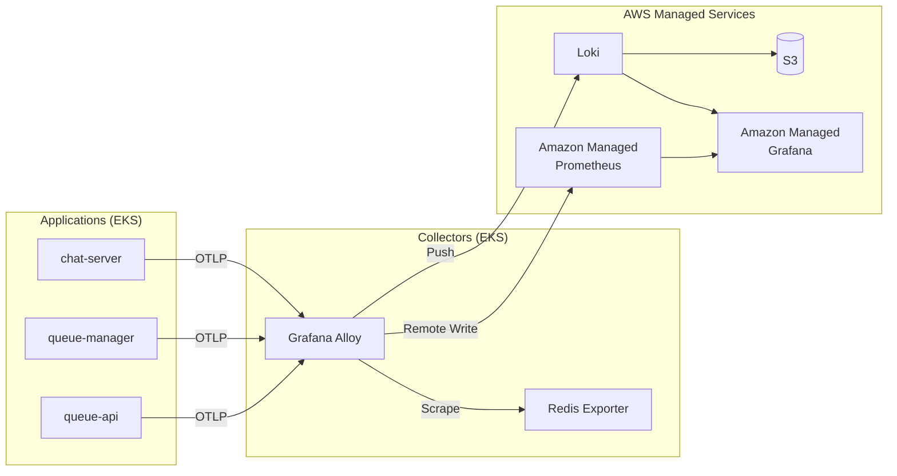
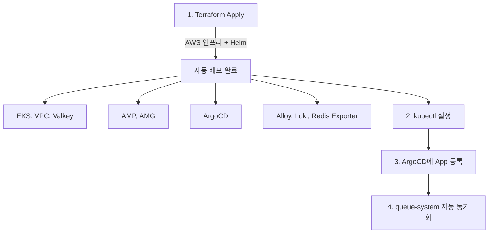

# Queue Infrastructure

게임 서버 대기열 시스템의 인프라 코드입니다.

## 아키텍처



## 컴포넌트

| 컴포넌트 | 유형 | 배포 방식 |
|----------|------|-----------|
| VPC, EKS, ElastiCache | AWS 인프라 | Terraform |
| Amazon Managed Prometheus | AWS 관리형 | Terraform |
| Amazon Managed Grafana | AWS 관리형 | Terraform |
| S3 (Loki Storage) | AWS 인프라 | Terraform |
| Grafana Alloy | EKS 워크로드 | Helm (grafana/alloy) |
| Loki | EKS 워크로드 | Helm (grafana/loki) |
| Redis Exporter | EKS 워크로드 | k8s manifest |
| queue-api, queue-manager, chat-server | EKS 워크로드 | Kustomize |

## 디렉토리 구조

```
queue-infra/
├── terraform/           # AWS 인프라 (VPC, EKS, ElastiCache, AMP, AMG)
│   ├── modules/
│   │   ├── eks/
│   │   └── vpc/
│   ├── dashboards/      # Grafana 대시보드 JSON
│   ├── main.tf
│   ├── observability.tf
│   └── ...
└── k8s/
    ├── apps/            # 애플리케이션 서비스 (Kustomize base)
    ├── overlays/
    │   └── production/  # 프로덕션 환경 오버레이
    ├── observability/   # 모니터링 스택
    │   ├── alloy-values.yaml
    │   ├── loki-values.yaml
    │   ├── alloy-configmap.yaml
    │   ├── redis-exporter.yaml
    │   └── configmap.yaml
    └── argocd/          # ArgoCD 설정
        ├── argocd-values.yaml    # ArgoCD Helm values
        ├── project.yaml          # AppProject
        └── applications/         # Application 정의
            ├── queue-system.yaml
            ├── observability-manifests.yaml
            ├── loki.yaml
            └── alloy.yaml
```

## 사전 요구사항

- AWS CLI 설정 완료
- Terraform >= 1.4
- kubectl
- Helm >= 3.0
- AWS IAM Identity Center 설정 (Amazon Managed Grafana 접근용)

## 배포 가이드

### 1. Terraform으로 전체 인프라 및 Helm 배포

```bash
cd terraform

terraform init
terraform plan
terraform apply
```

**Terraform이 자동으로 배포하는 리소스:**

**AWS 인프라:**
- VPC, Subnets, NAT Gateway
- EKS Cluster + Node Group
- ElastiCache (Valkey)
- Amazon Managed Prometheus (AMP)
- Amazon Managed Grafana (AMG)
- S3 Bucket (Loki 로그 저장소)
- IAM Roles (IRSA)
- ECR Repositories

**Helm Charts (EKS에 자동 설치):**
- ArgoCD
- Grafana Alloy
- Loki
- Redis Exporter

**Terraform 출력값 확인:**

```bash
terraform output grafana_workspace_endpoint
terraform output valkey_endpoint
terraform output argocd_initial_admin_password  # 비밀번호 조회 명령어
```

### 2. kubectl 설정

```bash
aws eks update-kubeconfig --name team3-eks-cluster --region ap-northeast-2
```

### 3. ArgoCD 접속

```bash
# ArgoCD URL 확인
kubectl get ingress -n argocd

# 초기 admin 비밀번호 확인
kubectl -n argocd get secret argocd-initial-admin-secret -o jsonpath="{.data.password}" | base64 -d
```

### 4. ArgoCD에서 애플리케이션 등록

ArgoCD UI 또는 CLI에서 queue-system 애플리케이션을 등록합니다.

```bash
cd k8s/argocd

# 1) applications/queue-system.yaml에서 repoURL 수정

# 2) Application 배포
kubectl apply -f project.yaml
kubectl apply -f applications/queue-system.yaml
```

> **Note:** Loki, Alloy, Redis Exporter는 Terraform이 이미 설치했으므로,
> ArgoCD에서는 queue-system (애플리케이션)만 관리하면 됩니다.

### 5. 배포 확인

```bash
kubectl get pods -n queue-system
kubectl get pods -n observability
kubectl get pods -n argocd
kubectl get ingress -n queue-system
```

## 배포 방식

### Terraform이 자동 배포하는 항목

| 컴포넌트 | 배포 방식 | 설명 |
|----------|-----------|------|
| VPC, EKS, ElastiCache | Terraform | AWS 인프라 |
| AMP, AMG | Terraform | AWS 관리형 모니터링 |
| ArgoCD | Terraform + Helm | GitOps CD 도구 |
| Grafana Alloy | Terraform + Helm | OTLP 수신 → AMP/Loki |
| Loki | Terraform + Helm | 로그 저장소 (S3) |
| Redis Exporter | Terraform + k8s | Valkey 메트릭 수집 |

### ArgoCD가 관리하는 항목

| 컴포넌트 | 배포 방식 | 설명 |
|----------|-----------|------|
| queue-api | ArgoCD + Kustomize | 대기열 API (HPA 지원) |
| queue-manager | ArgoCD + Kustomize | 티켓 발급 스케줄러 |
| chat-server | ArgoCD + Kustomize | WebSocket 게임 서버 |

## 모니터링 데이터 흐름



## 배포 순서



## 정리 (삭제)

```bash
# Terraform으로 모든 리소스 삭제 (Helm 포함)
cd terraform
terraform destroy
```

## 트러블슈팅

### Pod이 시작되지 않는 경우

```bash
kubectl describe pod <POD_NAME> -n <NAMESPACE>
kubectl logs <POD_NAME> -n <NAMESPACE>
```

### Valkey 연결 오류

```bash
terraform output -raw valkey_endpoint
kubectl get secret valkey-secret -n queue-system -o yaml
```

### Alloy가 AMP에 연결되지 않는 경우

```bash
kubectl describe sa alloy -n observability
kubectl logs -l app.kubernetes.io/name=alloy -n observability
```
