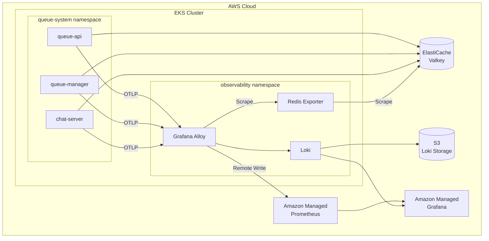
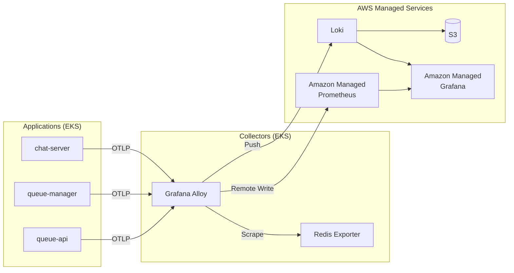
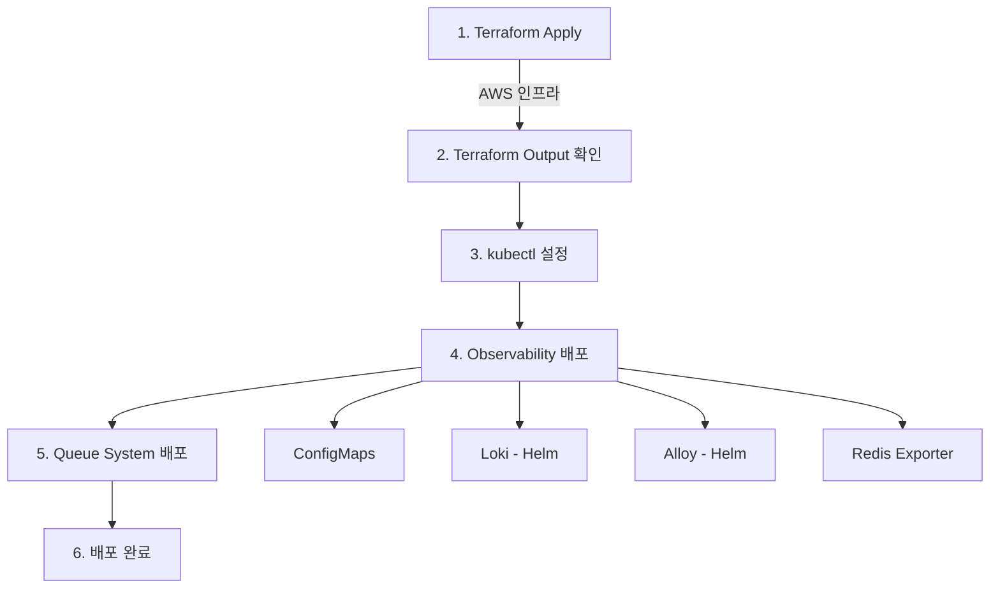

# Queue Infrastructure

게임 서버 대기열 시스템의 인프라 코드입니다.

## 아키텍처



## 컴포넌트

| 컴포넌트 | 유형 | 배포 방식 |
|----------|------|-----------|
| VPC, EKS, ElastiCache | AWS 인프라 | Terraform |
| Amazon Managed Prometheus | AWS 관리형 | Terraform |
| Amazon Managed Grafana | AWS 관리형 | Terraform |
| S3 (Loki Storage) | AWS 인프라 | Terraform |
| Grafana Alloy | EKS 워크로드 | Helm (grafana/alloy) |
| Loki | EKS 워크로드 | Helm (grafana/loki) |
| Redis Exporter | EKS 워크로드 | k8s manifest |
| queue-api, queue-manager, chat-server | EKS 워크로드 | Kustomize |

## 디렉토리 구조

```
queue-infra/
├── terraform/           # AWS 인프라 (VPC, EKS, ElastiCache, AMP, AMG)
│   ├── modules/
│   │   ├── eks/
│   │   └── vpc/
│   ├── dashboards/      # Grafana 대시보드 JSON
│   ├── main.tf
│   ├── observability.tf
│   └── ...
└── k8s/
    ├── apps/            # 애플리케이션 서비스 (Kustomize base)
    ├── overlays/
    │   └── production/  # 프로덕션 환경 오버레이
    └── observability/   # 모니터링 스택
        ├── alloy-values.yaml      # Alloy Helm values
        ├── loki-values.yaml       # Loki Helm values
        ├── alloy-configmap.yaml   # Alloy 설정
        ├── redis-exporter.yaml    # Redis Exporter
        └── configmap.yaml         # 공통 설정
```

## 사전 요구사항

- AWS CLI 설정 완료
- Terraform >= 1.4
- kubectl
- Helm >= 3.0
- AWS IAM Identity Center 설정 (Amazon Managed Grafana 접근용)

## 배포 가이드

### 1. Terraform으로 AWS 인프라 배포

```bash
cd terraform

terraform init
terraform plan
terraform apply
```

**배포되는 리소스:**
- VPC, Subnets, NAT Gateway
- EKS Cluster + Node Group
- ElastiCache (Valkey)
- Amazon Managed Prometheus (AMP)
- Amazon Managed Grafana (AMG)
- S3 Bucket (Loki 로그 저장소)
- IAM Roles (IRSA)
- ECR Repositories

**Terraform 출력값 확인:**
```bash
terraform output amp_workspace_id
terraform output loki_s3_bucket
terraform output alloy_role_arn
terraform output loki_role_arn
terraform output valkey_endpoint
terraform output grafana_workspace_endpoint
```

### 2. kubectl 설정

```bash
aws eks update-kubeconfig --name team3-eks-cluster --region ap-northeast-2
```

### 3. Observability Stack 배포

```bash
cd k8s/observability

# 1) Namespace 및 ConfigMap 배포
kubectl apply -f namespace.yaml
kubectl apply -f configmap.yaml        # AMP_WORKSPACE_ID 수정 필요
kubectl apply -f alloy-configmap.yaml

# 2) Grafana Helm repo 추가
helm repo add grafana https://grafana.github.io/helm-charts
helm repo update

# 3) Loki 배포 (S3 버킷, IAM Role ARN 수정 후)
helm upgrade --install loki grafana/loki \
  -n observability \
  -f loki-values.yaml

# 4) Alloy 배포 (IAM Role ARN 수정 후)
helm upgrade --install alloy grafana/alloy \
  -n observability \
  -f alloy-values.yaml

# 5) Redis Exporter 배포 (Valkey 엔드포인트 수정 후)
kubectl apply -f redis-exporter.yaml
```

### 4. Queue System 배포 (Kustomize)

```bash
cd ../overlays/production

# kustomization.yaml에서 Valkey 엔드포인트 수정
# secretGenerator의 SPRING_DATA_REDIS_HOST, ConnectionStrings__Valkey 값 변경

# 배포 미리보기
kubectl kustomize .

# 배포
kubectl apply -k .
```

### 5. 배포 확인

```bash
kubectl get pods -n queue-system
kubectl get pods -n observability
kubectl get ingress -n queue-system
```

## 배포 방식

### 애플리케이션 (Kustomize)

| 컴포넌트 | 설명 |
|----------|------|
| queue-api | 대기열 진입/상태 조회 API (HPA 지원) |
| queue-manager | 티켓 발급 스케줄러 |
| chat-server | WebSocket 게임 서버 |

### Observability

| 컴포넌트 | 배포 방식 | 설명 |
|----------|-----------|------|
| Grafana Alloy | Helm | OTLP 수신 → AMP/Loki로 전송 |
| Loki | Helm | 로그 저장소 (S3 백엔드) |
| Redis Exporter | k8s manifest | Valkey 메트릭 수집 |
| AMP | Terraform | 메트릭 저장소 (AWS 관리형) |
| AMG | Terraform | 대시보드 (AWS 관리형) |

## 모니터링 데이터 흐름



## 배포 순서



## 정리 (삭제)

```bash
# Queue System 삭제
kubectl delete -k k8s/overlays/production

# Observability 삭제
helm uninstall alloy -n observability
helm uninstall loki -n observability
kubectl delete -f k8s/observability/

# Terraform 리소스 삭제
cd terraform
terraform destroy
```

## 트러블슈팅

### Pod이 시작되지 않는 경우
```bash
kubectl describe pod <POD_NAME> -n <NAMESPACE>
kubectl logs <POD_NAME> -n <NAMESPACE>
```

### Valkey 연결 오류
```bash
terraform output -raw valkey_endpoint
kubectl get secret valkey-secret -n queue-system -o yaml
```

### Alloy가 AMP에 연결되지 않는 경우
```bash
kubectl describe sa alloy -n observability
kubectl logs -l app.kubernetes.io/name=alloy -n observability
```

