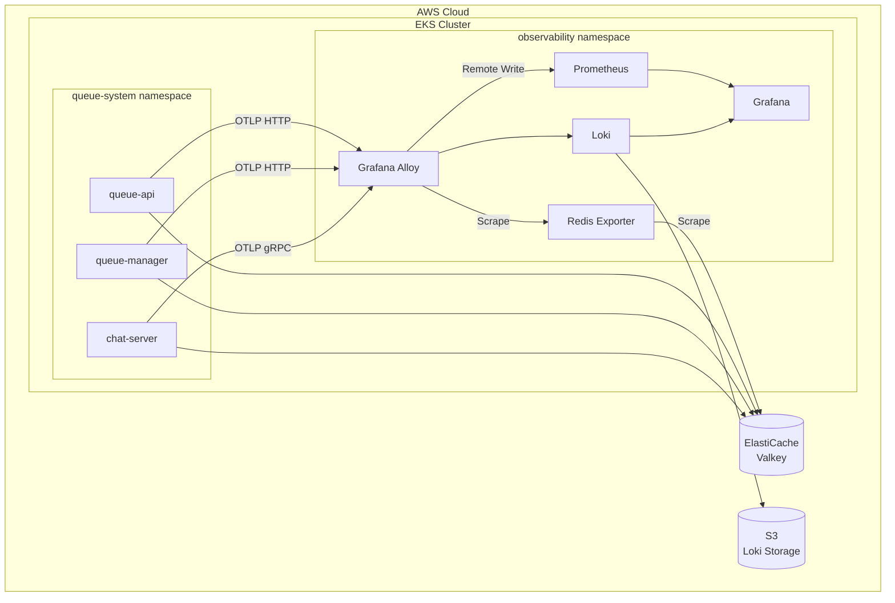

# Queue Infrastructure

게임 서버 대기열 시스템의 인프라 코드입니다.

## 아키텍처



## 컴포넌트

| 컴포넌트 | 유형 | 배포 방식 |
|----------|------|-----------|
| VPC, EKS, ElastiCache | AWS 인프라 | Terraform |
| S3 (Loki Storage) | AWS 인프라 | Terraform |
| Grafana Alloy | EKS 워크로드 | Helm (grafana/alloy) |
| Prometheus | EKS 워크로드 | Helm (prometheus-community/prometheus) |
| Loki | EKS 워크로드 | Helm (grafana/loki) |
| Grafana | EKS 워크로드 | Helm (grafana/grafana) |
| Redis Exporter | EKS 워크로드 | Helm (prometheus-community/prometheus-redis-exporter) |
| queue-api, queue-manager, chat-server | EKS 워크로드 | Kustomize |

## 디렉토리 구조

```plaintext
queue-infra/
├── ecr/                      # ECR 리포지토리 (독립 배포)
│   ├── main.tf
│   └── outputs.tf
├── terraform/                # AWS 인프라
│   ├── dev.tfvars            # 개발 환경 설정
│   ├── prod.tfvars           # 운영 환경 설정
│   ├── sample.tfvars         # 환경 설정 템플릿
│   ├── configs/              # Helm values 파일
│   ├── dashboards/           # Grafana 대시보드
│   ├── modules/
│   │   ├── eks/
│   │   └── vpc/
│   └── *.tf
└── k8s/
    ├── base/                 # Kustomize base (공통)
    └── overlays/
        ├── dev/              # 개발 환경 오버레이
        └── prod/             # 운영 환경 오버레이
```

## 환경별 설정

| 설정 | dev (최소 비용) | prod (운영) |
|------|----------------|-------------|
| EKS 노드 | t4g.small × 2 | t4g.large × 3 |
| Valkey | cache.t4g.micro, 단일 노드 | cache.t4g.medium, Multi-AZ |
| queue-api replicas | 1 | 3 |
| HPA max | 5 | 100 |

### 커스텀 환경 생성

`terraform/sample.tfvars`를 복사하여 새 환경을 생성할 수 있습니다.

#### 1. 환경 파일 생성

```bash
cd terraform
cp sample.tfvars staging.tfvars
```

#### 2. 설정 변수

| 변수 | 설명 | 예시 |
|------|------|------|
| `environment` | 환경 이름 (태깅용) | `dev`, `staging`, `prod` |
| `name_prefix` | 리소스 이름 접두사 | `team3-staging` |

**EKS 노드 그룹 설정:**

| 변수 | 설명 | dev 권장 | prod 권장 |
|------|------|----------|-----------|
| `node_instance_types` | EC2 인스턴스 타입 | `["t4g.medium"]` | `["t4g.large"]` |
| `node_desired_size` | 노드 수 (기본) | `2` | `3` |
| `node_min_size` | 최소 노드 수 | `2` | `3` |
| `node_max_size` | 최대 노드 수 | `3` | `10` |

**Valkey (ElastiCache) 설정:**

| 변수 | 설명 | dev 권장 | prod 권장 |
|------|------|----------|-----------|
| `valkey_node_type` | 캐시 노드 타입 | `cache.t4g.micro` | `cache.t4g.medium` |
| `valkey_multi_az` | Multi-AZ 활성화 | `false` | `true` |
| `valkey_replicas` | 복제본 수 | `0` | `1` |

> ⚠️ `valkey_multi_az = false`일 때 `valkey_replicas`는 반드시 `0`이어야 합니다.

**Grafana 설정:**

| 변수 | 설명 |
|------|------|
| `grafana_admin_user` | 관리자 계정 |
| `grafana_admin_password` | 관리자 비밀번호 |

**네트워크 설정 (선택):**

| 변수 | 설명 | 기본값 |
|------|------|--------|
| `vpc_cidr` | VPC CIDR | `10.23.0.0/16` |
| `azs` | 가용 영역 | `["ap-northeast-2a", "ap-northeast-2c"]` |
| `public_subnets` | 퍼블릭 서브넷 | `["10.23.1.0/24", "10.23.2.0/24"]` |
| `private_subnets` | 프라이빗 서브넷 | `["10.23.11.0/24", "10.23.12.0/24"]` |
| `cluster_version` | EKS 버전 | `1.34` |

#### 3. 설정 예시 (staging 환경)

```hcl
# staging.tfvars
environment = "staging"
name_prefix = "team3-staging"

# EKS - dev보다 약간 높은 사양
node_instance_types = ["t4g.medium"]
node_desired_size   = 2
node_min_size       = 2
node_max_size       = 5

# Valkey - Multi-AZ 비활성화 (비용 절감)
valkey_node_type = "cache.t4g.small"
valkey_multi_az  = false
valkey_replicas  = 0

# Grafana
grafana_admin_user     = "admin"
grafana_admin_password = "staging-secure-password"
```

#### 4. 배포

```bash
terraform apply -var-file staging.tfvars
```

#### 5. Kustomize 오버레이 추가 (선택)

새 환경에 맞는 Kustomize 오버레이를 생성하려면:

```bash
# 기존 오버레이 복사
cp -r k8s/overlays/dev k8s/overlays/staging

# kustomization.yaml에서 namespace, replica 등 수정
```

## 사전 요구사항

- AWS CLI 설정 완료
- Terraform >= 1.4
- kubectl
- Helm >= 3.0

## 배포 가이드

### 1. ECR 리포지토리 생성 (최초 1회)

```bash
cd ecr

terraform init
terraform plan
terraform apply
```

**생성되는 ECR 리포지토리:**

- queue-api
- queue-manager
- chat-server

### 2. 컨테이너 이미지 빌드 및 푸시

```bash
# ECR 로그인
aws ecr get-login-password --region ap-northeast-2 | docker login --username AWS --password-stdin <ECR_REGISTRY>

# 각 서비스 이미지 빌드 및 푸시
docker build -t <ECR_REGISTRY>/queue-api:latest ./queue-api
docker push <ECR_REGISTRY>/queue-api:latest

docker build -t <ECR_REGISTRY>/queue-manager:latest ./queue-manager
docker push <ECR_REGISTRY>/queue-manager:latest

docker build -t <ECR_REGISTRY>/chat-server:latest ./chat-server
docker push <ECR_REGISTRY>/chat-server:latest
```

### 3. Terraform으로 인프라 배포

환경에 맞는 `.tfvars` 파일을 선택하여 배포합니다.

```bash
cd terraform
terraform init
terraform apply -var-file <ENV>.tfvars
```

| 환경 | Terraform 설정 | Kustomize 오버레이 |
|------|----------------|-------------------|
| 개발 | `dev.tfvars` | `k8s/overlays/dev` |
| 운영 | `prod.tfvars` | `k8s/overlays/prod` |

**Terraform이 자동으로 배포하는 리소스:**

**AWS 인프라:**

- VPC, Subnets, NAT Gateway
- EKS Cluster + Node Group
- ElastiCache (Valkey)
- S3 Bucket (Loki 로그 저장소)
- IAM Roles (IRSA)

**Helm Charts (EKS에 자동 설치):**

- Grafana Alloy
- Loki
- Prometheus
- Grafana
- Metrics Server
- Redis Exporter

**Terraform 출력값 확인:**

```bash
terraform output valkey_endpoint
terraform output grafana_url  # ALB를 통해 접근 가능한 Grafana URL
```

**Grafana 접속:**
- URL: Terraform output의 `grafana_url` 또는 `kubectl get ingress -n observability`로 확인
- 기본 계정: admin / admin

### 4. kubectl 설정

```bash
aws eks update-kubeconfig --name team3-<ENV>-eks-cluster --region ap-northeast-2
```

| 환경 | 클러스터 이름 |
|------|--------------|
| 개발 | `team3-dev-eks-cluster` |
| 운영 | `team3-prod-eks-cluster` |

### 5. Queue System 배포 (Kustomize)

```bash
kubectl apply -k k8s/overlays/<ENV>
```

| 환경 | 오버레이 경로 |
|------|--------------|
| 개발 | `k8s/overlays/dev` |
| 운영 | `k8s/overlays/prod` |

### 6. 배포 확인

```bash
kubectl get pods -n queue-system
kubectl get pods -n observability
kubectl get ingress -n queue-system
```

## 배포 방식

### Terraform이 자동 배포하는 항목

| 컴포넌트 | 배포 방식 | 설명 |
|----------|-----------|------|
| VPC, EKS, ElastiCache | Terraform | AWS 인프라 |
| Grafana Alloy | Terraform + Helm | OTLP 수신 → Prometheus/Loki |
| Loki | Terraform + Helm | 로그 저장소 (S3) |
| Prometheus | Terraform + Helm | 메트릭 저장소 |
| Grafana | Terraform + Helm | 대시보드 (ALB Ingress로 외부 노출) |
| Redis Exporter | Terraform + Helm | Valkey 메트릭 수집 |

### Kustomize로 배포하는 항목

| 컴포넌트 | 배포 방식 | 설명 |
|----------|-----------|------|
| queue-api | Kustomize | 대기열 API (HPA 지원) |
| queue-manager | Kustomize | 티켓 발급 스케줄러 |
| chat-server | Kustomize | WebSocket 게임 서버 |

## 모니터링 데이터 흐름


## 배포 순서


## 정리 (삭제)

```bash
# 1. 애플리케이션 삭제
kubectl delete -k k8s/overlays/<ENV>

# 2. 인프라 삭제
cd terraform
terraform destroy -var-file <ENV>.tfvars

# 3. ECR 삭제 (이미지가 있으면 먼저 삭제 필요)
cd ../ecr
terraform destroy
```

| 환경 | Kustomize 삭제 | Terraform 삭제 |
|------|----------------|----------------|
| 개발 | `kubectl delete -k k8s/overlays/dev` | `terraform destroy -var-file dev.tfvars` |
| 운영 | `kubectl delete -k k8s/overlays/prod` | `terraform destroy -var-file prod.tfvars` |

## 트러블슈팅

### Pod이 시작되지 않는 경우

```bash
kubectl describe pod <POD_NAME> -n <NAMESPACE>
kubectl logs <POD_NAME> -n <NAMESPACE>
```

### Valkey 연결 오류

```bash
terraform output -raw valkey_endpoint
kubectl get secret valkey-secret -n queue-system -o yaml
```

### Alloy가 Prometheus에 연결되지 않는 경우

```bash
kubectl describe sa alloy -n observability
kubectl logs -l app.kubernetes.io/name=alloy -n observability
```

### Helm 배포(Loki 등)가 오래 걸리거나 실패하는 경우

Loki와 같은 무거운 Helm 차트 배포 시 `Pending` 상태로 멈추거나 타임아웃이 발생한다면, EKS 노드의 리소스 부족 또는 Pod 개수 제한(Max Pods)에 도달했을 가능성이 높습니다.

**해결 방법:**

1. **노드 인스턴스 타입 상향**: `t4g.small` 등 작은 인스턴스는 노드당 실행 가능한 Pod 수가 적습니다 (예: t4g.small은 11개). `t4g.medium` 이상으로 변경하세요.
2. **노드 수 증가**: 노드 그룹의 `desired_size`를 늘려 Pod를 분산시키세요.

